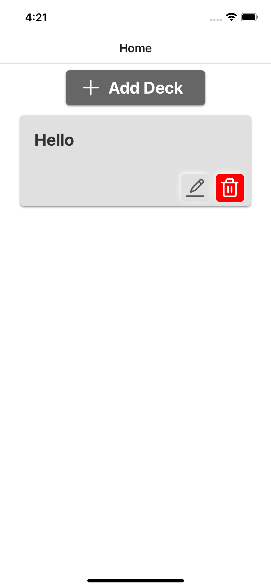

# Flash Card Project

## Description
This project implements simple flash cards app for multi plat forms.

## Authors
Aono Haruku
Tabito Satoh
Dai Fukunaga

## Demo


## Getting Started
### Requires
* Windows/Mac/Android/iOS
* npm 8.19.1
* npx 8.19.1
* expo 6.3.2

### Executing Program
* Run the code on PC
```bash
npx expo start
```

## Designs
This flash card app is implemented by Expo (React Native).

## Bugs
Edit function does not work.
